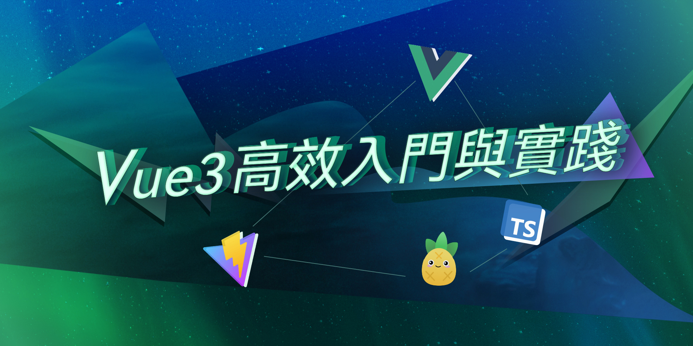

<h1 align="center"> Vue3 高效入門與實踐</h1>

 本課程將帶你一步步的學習理解 Vue3 每個重要的語法以及搭配 TypeScript 進行開發，讓同學們可以嘗試處理專案上面周邊技術的整合應用，以及體驗更真實的實際開發會遇到的問題情境，來教你思考解決如何解決問題，你將會一步步的學習到前端工程師在開發專案時的經驗過程。

   

## 🚀 你可以學到：

- 🎪 **Vue3 完整使用方式及基礎觀念** 
- 🦾 **官方推薦的 Pinia 做專案全域狀態管理**
- 🔋 **使用 vue-router 來開發高效能 SPA 網頁**
- 🔩 **最新的 Vite 的開發工具**
- 🌎 **Vue3 + TypeScript 開發流程與應用方式**

---

 

TheCodingPro © All rights reserved.

